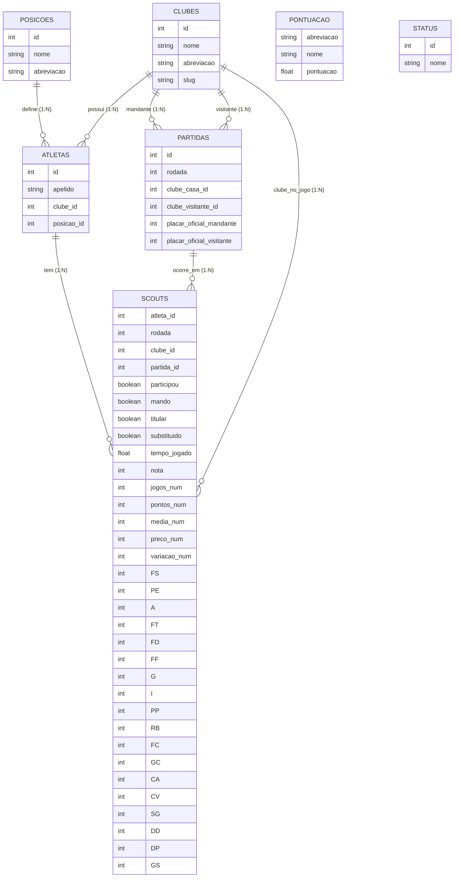

# Diagrama Entidade-Relacionamento (DER)

O diagrama abaixo representa as entidades e relacionamentos do domínio (camada raw) conforme o MER e o dicionário de dados.

Notas
- Chave composta de `SCOUTS` (atleta_id, rodada, partida_id) é conceitual; Mermaid ER não suporta declarar PK composta no bloco, por isso está documentada aqui.
- `Scouts.posicao_id`: presente no dicionário, mas passível de remoção futura (informação já está em Atletas → Posicoes).
- Tabelas `PONTUACAO` e `STATUS` são referenciais/apoio e não se relacionam diretamente às demais neste modelo conceitual.

<b>Autores:</b>  <a href="https://github.com/leohssjr">Leonardo Sauma</a>, <a href="https://github.com/lramon2001">Lucas Ramon</a>. 2025

